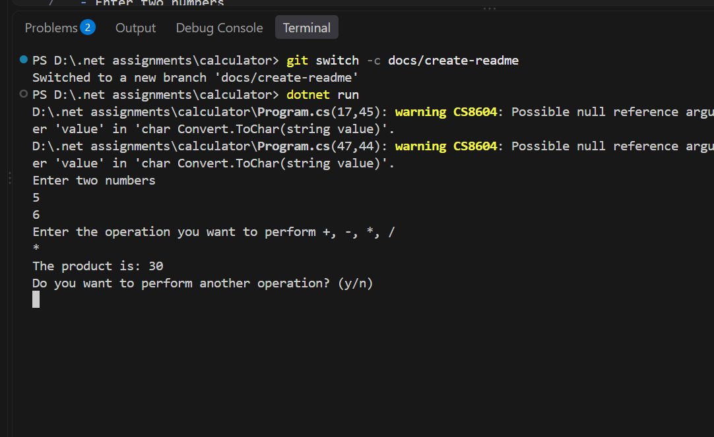
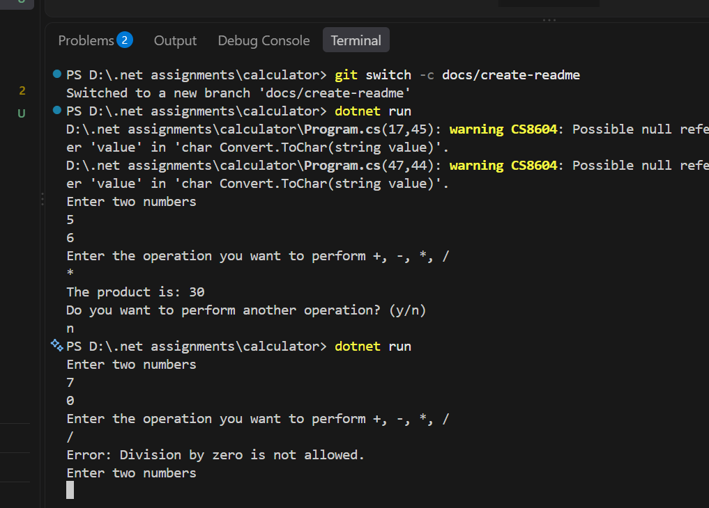

# C# Basic Calculator

A simple console-based calculator built with **C#** and **.NET**.

## Features

- Enter two numbers
- Addition (`+`)
- Subtraction (`-`)
- Multiplication (`*`)
- Division (`/`)
- Supports decimal numbers
- Continue performing calculations using a loop

## Screenshot




## How to Run

Run the project using:

```bash
dotnet run